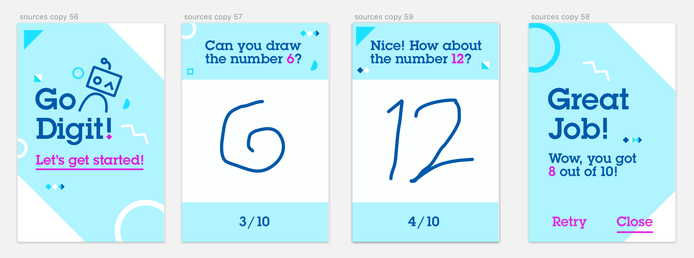
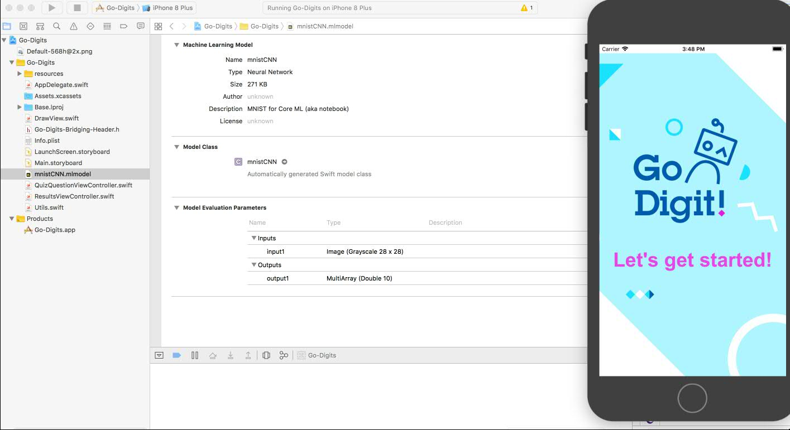

# From Neural Network Modeler to iOS application

This tutorial shows how to design convolutional neural network with **Deep learning experiment** (part of Watson Studio), train it using GPU cluster, deploy and finally make part of an iOS sample application.

  

## Requirements
- **Watson Studio** with deep learning capabilities
- Xcode 11

## Deep learning model training

1. In Watson Studio project add new Deep learning experiment.

2. Click `Add training definition` and then upload source code of [model](https://github.ibm.com/WML/watson-machine-learning-samples/blob/dev/definitions/keras/mnist/MNIST.zip) for hand written digits recognition (MNIST).

3. Set framework to `tensorflow_1.15-py3.6`.

4. Set execution comand to `python3 mnist_mlp.py --trainImagesFile ${DATA_DIR}/train-images-idx3-ubyte.gz --trainLabelsFile ${DATA_DIR}/train-labels-idx1-ubyte.gz --testImagesFile ${DATA_DIR}/t10k-images-idx3-ubyte.gz --testLabelsFile ${DATA_DIR}/t10k-labels-idx1-ubyte.gz --learningRate 0.001 --trainingIters 6000`.

5. Create training definition.

6. Create connection with Cloud Object Storage in order to store training data files and results.

7. Click `Create and run`.

## Trained model deployment as Core ML
1. Open trained model details and click `Actions` and then `Save model`.

2. Promote stored model to deployment space by going to model details and clicking
`Promote to deployment space`.

3. Select your model and click `deploy`.

4. Select deployment type as `Core ML`

5. Create Deployment

## Core ML model integration with sample application

1. In deployment details you can find `download_url` that allows to get Core ML content of Deployment. Download the Core ML model.

2. Clone the following [sample application swift project](https://github.com/pmservice/go-digits) from github.

3. Open **Go-Digits.xcodeproj** in Xcode 11.

4. Add Core ML model to the project. Rename it to `mnistCNN.mlmodel`

5. Next build application and run it on a device or simulator with iOS 13.

  

