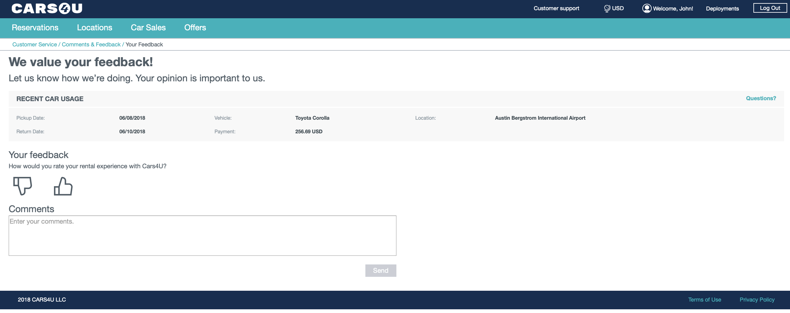

# Car Rental Sample Application



## Requirements

- python 3
- pip
- python libs: urllib3, ibm-watson-machine-learning, cfenv, Flask, watson-developer-cloud

User also should have account on Bluemix with active us-south region. In us-south region the following services should be prepared:
- IBM Machine Learning (wml). Please note that `Lite` (free) plan is offered.

Deployments and models preparation:
[Notebooks](./WS_PROJECT_SETUP.md)

Optional services:
- Natural Language Understanding. Please note that `Lite` (free) plan is offered.

## Deployment

### Initial configuration

1. Clone repository and enter cloned project directory:  

   ```bash
   git clone https://github.com/IBM/watson-machine-learning-samples/tree/master/cloud/applications/cars-4-you
   cd cars-4-you
   ```

2. Update with your Machine Learning service details the folowing files:

- `settings/wml.json` (Machine Learning service)
- `settings/nlu.json` (Natural Language Understanding)

### Deployment and run on local environment

Run:

```bash
pip install -r requirements.txt
export FLASK_APP=server.py
flask run
```

Application will be available at `127.0.0.1:5000`.

### Deployment and run on IBM Cloud (Bluemix)

1. Modify `manifest.yml` by choosing unique name for your host and passing it in place of `<your host name>`.
2. Run:

   ```bash
   bx api https://api.ng.bluemix.net
   bx login
   bx app push
   ```

Application will be available on bluemix.
