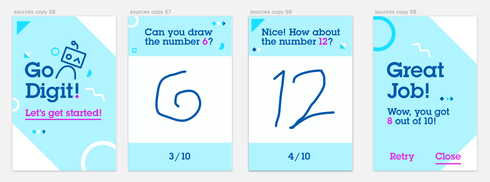

# From Neural Network Modeler to iOS application

This tutorial shows how to design convolutional neural network with **Deep learning experiment** (part of Watson Studio), train it using GPU cluster, deploy and finally make part of an iOS sample application.

  

## Requirements
- **Watson Studio** with deep learning capabilities
- Xcode 11

## Deep learning model training

1. Run this [notebook](https://github.com/IBM/watson-machine-learning-samples/blob/master/cloud/notebooks/python_sdk/deployments/coreml/Use%20Keras%20and%20Core%20ML%20to%20recognize%20hand-written%20digits.ipynb) in order to create and deploy Core ML model.

## Core ML model integration with sample application

1. Clone the following [sample application swift project](https://github.com/IBM/watson-machine-learning-samples/tree/master/cloud/applications/go-digits) from github.

2. Open **Go-Digits.xcodeproj** in Xcode 11.

3. Add model produced by notebook to Xcode project.

4. Next build application and run it on a device or simulator with iOS 13.

  

