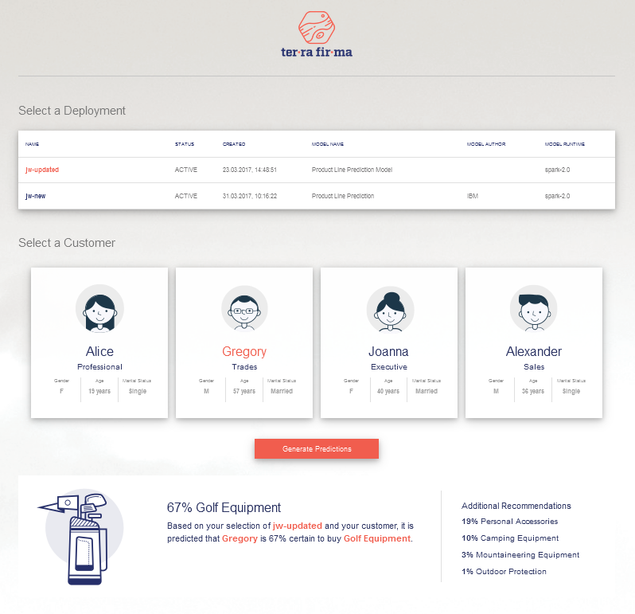

[pa]: https://console.ng.bluemix.net/catalog/services/ibm-watson-machine-learning/  "ML"
[bm]: https://console.ng.bluemix.net/
[pa-api]: https://watson-ml-v4-api.mybluemix.net/wml-restapi-cloud.html

# About
The application demonstrates usage of [IBM Watson Machine Learning][pa] [Bluemix][bm] offering.

Application is based on Node.js and Express framework and utilizes [IBM Watson Machine Learning REST API][pa-api].

Within this sample scoring application you are able to:
* select one of online deployments (scoring)
* select one of customers
* make score requests by using 'Generate Predictions' button
* display predicted recommendations for selected customer

# Requirements
* [IBM ID](https://www.ibm.com/account/profile/us?page=reg) to login to [Bluemix][bm]; see [free trial](http://www.ibm.com/developerworks/cloud/library/cl-bluemix-fundamentals-start-your-free-trial/index.html) article if you don't yet have it
* [Cloud Foundry command line interface](https://github.com/cloudfoundry/cli/releases) (only if you want to manually deploy to Bluemix)
* [Node.js](https://nodejs.org) runtime (only if you want to modify the source code)

### Prepare Bluemix ecosystem
1. From Bluemix catalog choose [IBM Watson Machine Learning][pa] service. This service will later be binded with a Node.js application created from this sample.
2. Create deployment of type *online* using *Product Line Prediction* model from this [notebook](../../notebooks/python_sdk/deployments/spark/Use%20Spark%20to%20predict%20product%20line.ipynb)

# Application Deployment
**Note:** the application is fully functional only if binded with an instance of *IBM Watson Machine Learning* service, which needs to be done manually. Check [instructions](#binding-services-in-bluemix) how to do it.

### Manual Bluemix deployment
The application can be manually deployed to Bluemix by pushing it with Cloud Foundry commands, as described in next [section](#push-to-bluemix). Manual deployment is also required when you want to deploy [modified source code](#source-code-changes). Manual deployment consists of [pushing](#push-to-bluemix) the application to Bluemix followed with [binding](#binding-services-in-bluemix) *IBM Watson Machine Learning* service to deployed application.

##### Push to Bluemix
To push an application to Bluemix, open a shell, change to directory of your application and execute:
  * `cf api <region>` where <*region*> part may be https://api.ng.bluemix.net or https://api.eu-gb.bluemix.net depending on the Bluemix region you want to work with (US or Europe, respectively)
  * `cf login` which is interactive; provide all required data
  * `cf push <app-name>` where <*app-name*> is the application name of your choice

`cf push` can also read the manifest file, see [Cloud Foundry Documentation](http://docs.cloudfoundry.org/devguide/deploy-apps/manifest.html). If you decide to use manifest, you can hardcode the name of your instance of IBM Watson Machine Learning service instead of binding it manually, see *services* section [manifest.yml.template](manifest.yml.template) file.

If this is your first Bluemix Node.js application, refer [documentation of node-helloworld project](https://github.com/IBM-Bluemix/node-helloworld) to gain general experience.

##### Bind IBM Watson Machine Learning service
See [instructions](#binding-services-in-bluemix)

### Local deployment
Running the application locally is useful when you want to test your changes before deploying them to Bluemix. To see how to work with source code, see [Source code changes](#source-code-changes).

When the changes are ready, open a shell, change directory to your cloned repository and execute `npm start` to start the application. The running application is available in a browser at http://localhost:6001 url.

Application run locally can also use Bluemix *IBM Watson Machine Learning* service, see [instructions](#link-local-application-with-the-bluemix-environment) how to link it.

## Source code changes
The repository comes with pre-build app. If you want to rebuild application after modifying the sources:
  * Follow steps listed in [Requirements](#requirements) section
  * Change to directory with downloaded source code or cloned git repo
  * Execute `npm install`
  * Execute `./node_modules/.bin/webpack`

# IBM Watson Machine Learning service
The source code placed in [service-client.js](server/service-client.js) file is an example of how to call [IBM Watson Machine Learning REST API][pa-api] through JavaScript code. It demonstrates following aspects:
  * Access token generation
  * Retrieval of online deployments
  * Extracting model from a deployment to make sure the deployment's model has expected schema
  * Scoring with a chosen online deployment

## Binding services in Bluemix
As stated in [Requirements](#requirements) section, from Bluemix catalog order an instance of *IBM Watson Machine Learning* service if you don't yet have it. Next step is to connect your deployed application with service, which is called *binding*. There are a few options to achieve that in Bluemix environment, [link](https://console.ng.bluemix.net/docs/cfapps/ee.html) describes binding either by Bluemix user interface or by using cf cli.

## Link local application with the Bluemix environment
1. Open your instance of [IBM Watson Machine Learning][pa].
2. Go to *Service Credentials* pane and press *View Credentials*. Copy json provided (url, username, password).
3. Create *./config/local.json* file by copying *./config/local.json.template* file. Edit the *local.json* file and paste obtained pm-20 credentials.
4. Start your local application. You should be able to interact with the *IBM Watson Machine Learning* service e.g. by listing the deployments.

# License
The code is available under the Apache License, Version 2.0.
